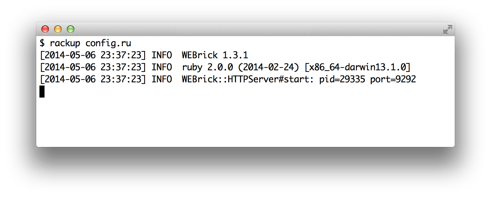
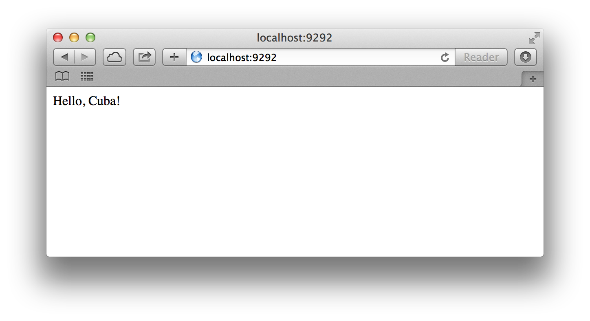

Hello Cuba!
===========

Before getting started, we have to install Cuba. Use the `gem` command:

```
$ gem install cuba
```

Now that Cuba is installed, it's easy to create a Cuba application. Open
your text editor of preference and create a file called `config.ru` with
the following code:

```ruby
require "cuba"

Cuba.define do
  on root do
    res.write("Hello, Cuba!")
  end
end

run(Cuba)
```

You already have a functional Cuba application! To see it in action, type
`rackup config.ru` in the command line.



Now open a browser and navigate to <http://localhost:9292/>. It should
show a greeting message as shown below:



> **NOTE:** To stop the web server, hit `Ctrl+C` in the terminal window
where it's running. To verify the server has stopped you should see your
command prompt cursor again.

As you can see, the syntax is very readable. We'll discuss the details
in the next section.
