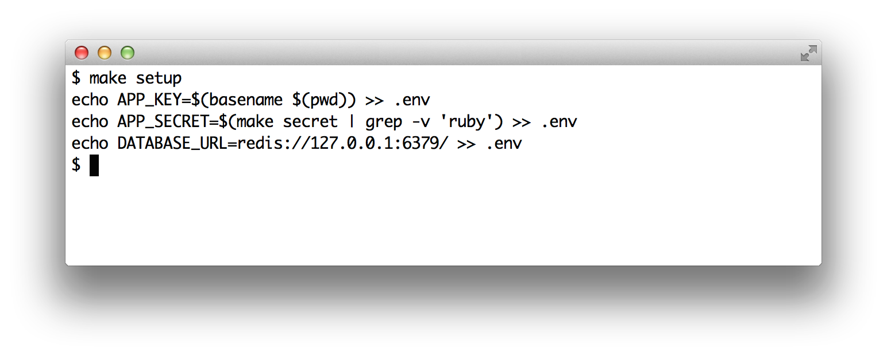
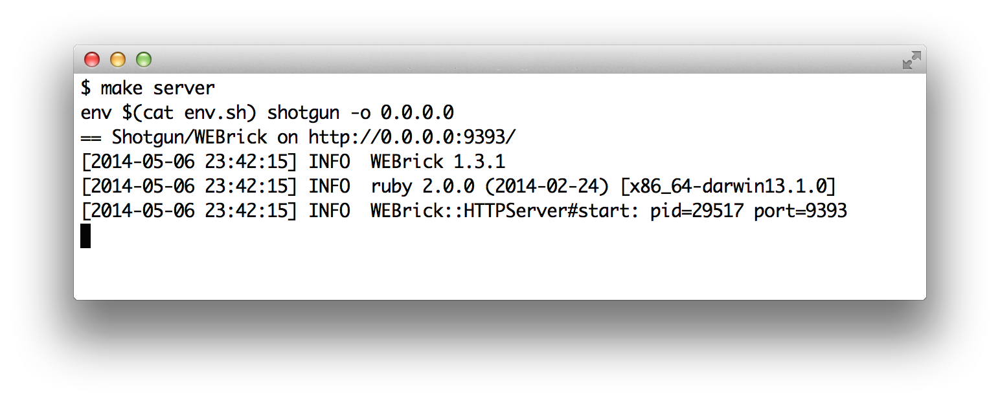
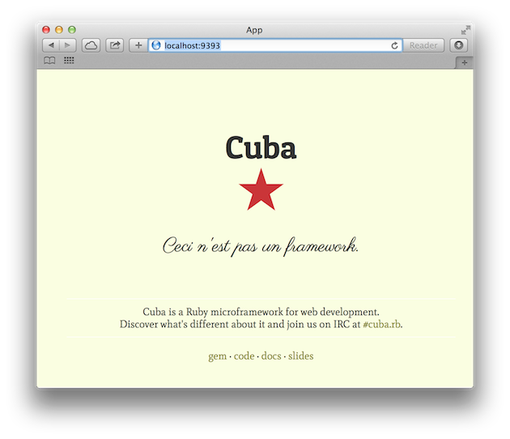

Up and Running
==============

Now that we've installed the dependencies, it's time to see how our
minimal application looks.

To get it up and running, we need to create a file with some
configurations. Go to the command line and type `make setup`.



As you can see, this created a file called *.env*. For now, it's enough
for you to know that this file contains sensitive configurations for the
application. We'll discuss this in more detail later.

To see the application in action, type `make server` in the command line.



Unlike before, we're now using *shotgun* instead of *rackup*. *Shotgun*
is a gem that reloads the application for every request. That's great for
development because we don't need to restart the server every time that
we change the application. Now navigate to <http://localhost:9393/>. You
should see the Cuba welcome page.



*Shotgun* uses a *config.ru* file just like *rackup*. Let's see what the
*config.ru* file looks like in this template.

```ruby
require "./app"

run(Cuba)
```

This time the definition of the application has been placed in a different
file. This file is called *app.rb* and is the main file of our application.
In the next section, we'll explore this file.
