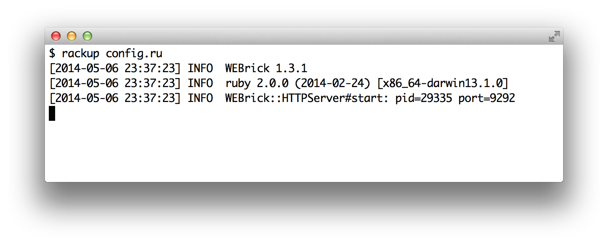
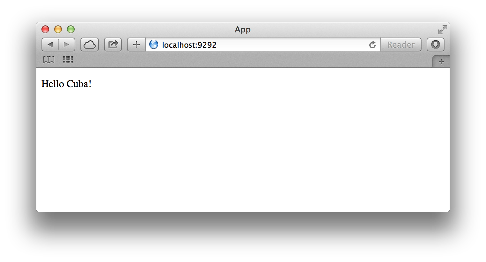

¡Hola Cuba!
===========

Antes de empezar, necesitamos instalar Cuba. Puedes usar
el comando `gem`:

```
$ gem install cuba
```

Ahora que Cuba está instalado, es muy fácil crear una aplicación en Cuba.
Abre tu editor de texto favorito y crea un archivo llamado `config.ru` con
el siguiente código:

```ruby
require "cuba"

Cuba.define do
  on root do
    res.write("Hello, Cuba!")
  end
end

run(Cuba)
```

¡Ya tienes tu primera aplicación Cuba! Para verla en acción, sólo escribe
`rackup config.ru` en la línea de comandos.



Ahora abre un navegador e ingresa a <http://localhost:9292/>. Deberá
aparecer un mensaje de bienvenida como el que se muestra más abajo:



> **NOTA:** Para detener el servidor web, presiona `Ctrl+C` en la ventana
donde está corriendo. Para verificar que el servidor se haya detenido
debes ver el cursor de la línea de comandos nuevamente.

Como puedes ver, la sintaxis es muy legible. Vamos a discutir todos
los detalles en la siguiente sección.
